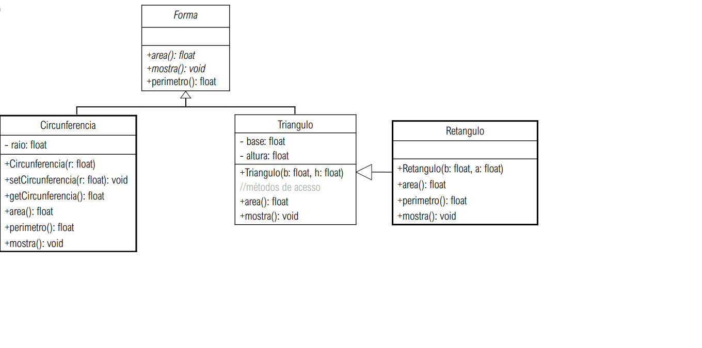

# Formas

# Diagrama

# Funcionalidade

  # Subclasse Circunferência

    # - O método area() deve retornar valor da área da circunferência, sabendo que area = p*r2
    # - O método perimetro() deve retornar o valor do perímetro: perimetro = 2*p*r
    # - Em ambos os métodos utilize a constante Math.PI da classe Math
    # - O método mostra deve exibir os valores de todos os atributos da classe
    
  # Subclasse Triângulo
  
    # - O método area() deve retornar valor da área do triângulo, sabendo que area = (base * altura)/2
    
  # Subclasse Retângulo
  
    # - O método area() deve retornar valor da área do retângulo, sabendo que area = base * altura
    # - O método perimetro() deve retornar o valor do perímetro: perimetro = (base * altura) * 2
    # - O método mostra deve exibir os valores de todos os atributos da classe
    
  # Classe main: Instancie dois objetos na classe java principal, um da classe Circunferencia e outro da classe Retângulo, com os valores dos atributos digitados pelo usuário e utilize o construtor com parâmetros. Mostre os dados de cada objeto através do método mostra().
